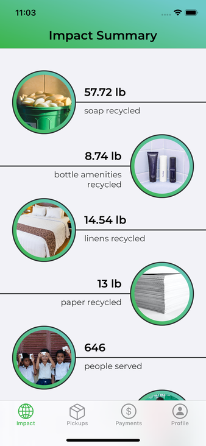
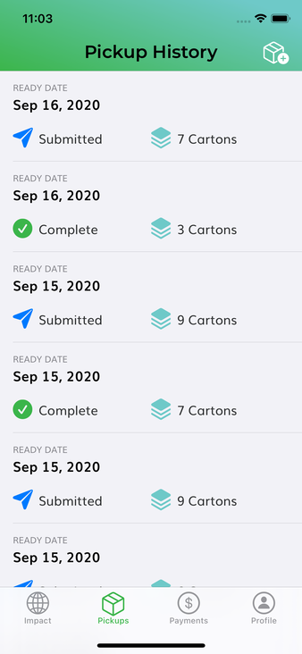
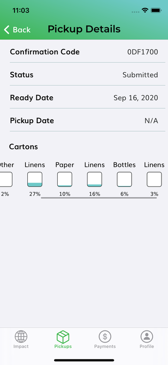
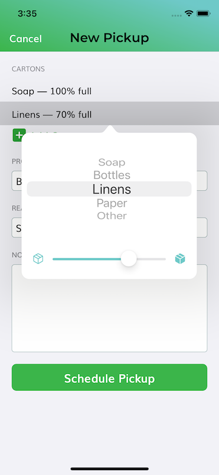
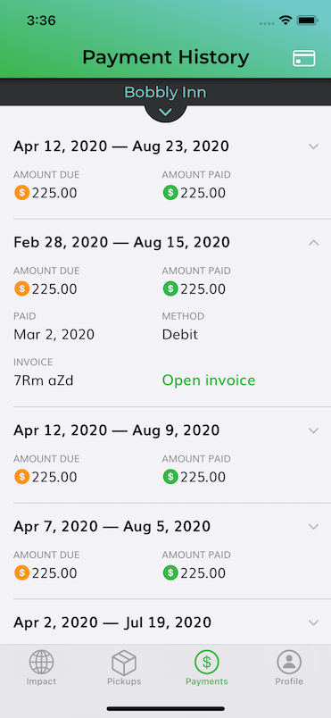

# Eco-Soap Bank

 [![Swift Version][swift-image]][swift-url] [![License][license-image]][license-url]  

Eco-Soap Bank is a humanitarian and environmental non-profit organization working to save, sanitize, and supply recycled hotel soap for the developing world.

The iOS app enables hotel partners to track pickups of recycled supplies, payments, administrative information, and the positive impact their contributions are having on the world.

    

## Contributors

- [Jon Bash](http://www.github.com/jonbash)
- [Christopher DeVito](http://www.github.com/DeVitoC)
- [Shawn Gee](http://www.github.com/swift-student)

## Build Instructions

**Requires**:

- [Xcode 11+](https://developer.apple.com/xcode/)
- [Carthage](https://github.com/Carthage/Carthage)

---

1. Clone the project
2. In a terminal in the project directory, run `carthage bootstrap`
3. Open the project in Xcode, build, and run.

[swift-image]: https://img.shields.io/badge/swift-5.2-orange.svg
[swift-url]: https://swift.org/
[license-image]: https://img.shields.io/badge/License-MIT-blue.svg
[license-url]: LICENSE
